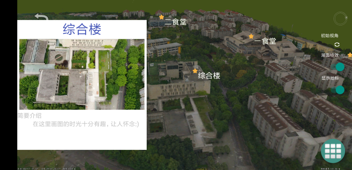
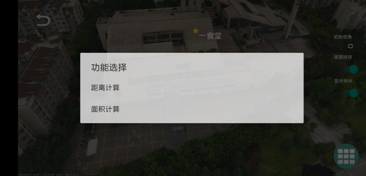

# 虎溪模型展示 App
---

## 1 功能总览

### 1.0 地标功能

* 地标搜索框

    - [X] 展现出所有地标
    - [X] 点击相应选项，切换视角到对应的地点

* 地标介绍框

    - [X] 地标名
    - [X] 地标实景 GIF 图
    - [X] 简要介绍信息
    - [X] 点击地标附近，会弹出附近地标信息框

### 1.1 推荐路线

- [X] 读取飞行路线，具备飞行功能
- [X] 左侧显示当前站点
- [X] 点击左侧选项，能够弹出介绍框。
- [X] 暂停，启动按钮响应完成。

### 1.2 测量功能

- [X] 距离测量
- [X] 面积测量

### 1.3 无人机模拟器

- [X] 水平方向移动
- [X] 垂直方向移动
- [X] 方向调整
- [X] 俯仰角调整
- [X] 速度调整

### 1.4 主界面功能

- [X] 重置视角
- [X] 湖面特效开关
- [X] 地标显示开关
- [X] 重置视角

## 2 界面及功能介绍
---

### 2.0 重置视角

### 2.1 主界面

打开 App，将会得到如下界面。滑动后点击感兴趣的选项，进入模型展示界面，进一步查看模型。支持的选项有：

虎溪校区：

B校区：

A校区：

### 2.2 校区模型展示界面

#### 2.2.0 总体界面

左上角返回，右下角菜单。

#### 2.2.1 弹出菜单

点击后，弹出四个选项，对应四个功能

1. 搜索：点击选项后跳转到地标附近
2. 推荐路线：在飞行过程中进行浏览
3. 测量：了解地理信息
4. UAV模拟器：模拟无人机

#### 2.2.2 搜索

点击搜索，弹出地标选项框：

选择对应选项,飞到地标附近，弹出介绍框：

#### 2.2.3 推荐路线

选择推荐路线后，可以选择数条路线：

选择感兴趣的一条，开始飞行:

飞行过程中可以点击右侧的地标站，就能看到站点介绍:

飞行过程中，可以点击站点框下的控制按钮，完成暂停、停止和退出控制。

#### 2.2.4 测量功能

让用户知道感兴趣的地方地理信息，感受更加直观。选择测量功能，得到两个测量模式。

距离测量：根据点之间的连线，底部提示测量距离:

面积测量：点击出多个点，形成闭合的面，底部提示测量面积:

##### 2.2.5 无人机模拟器

点击无人机模拟器之后，弹出如下无人机相关操作界面：

1. 拖动左侧摇杆：上下方向完成上升和下降功能，左右方向完成旋转功能。
2. 拖动右侧摇杆：上下法国想完成前进和后退功能，左右方向完成平移功能。
3. 竖直条：从左到右分别对应：旋转速度、升降速度和平移系数。

通过操作以上控件可以完成模拟飞行器的功能。

#### 2.2.6 右上角功能选项

点击湖面特效开关，则会开启、关闭湖面特效。依据手机性能和需求做出选择：

关闭掉右侧的显示地标，所有地标将会被隐藏，点击弹出介绍框的功能不能够响应：

